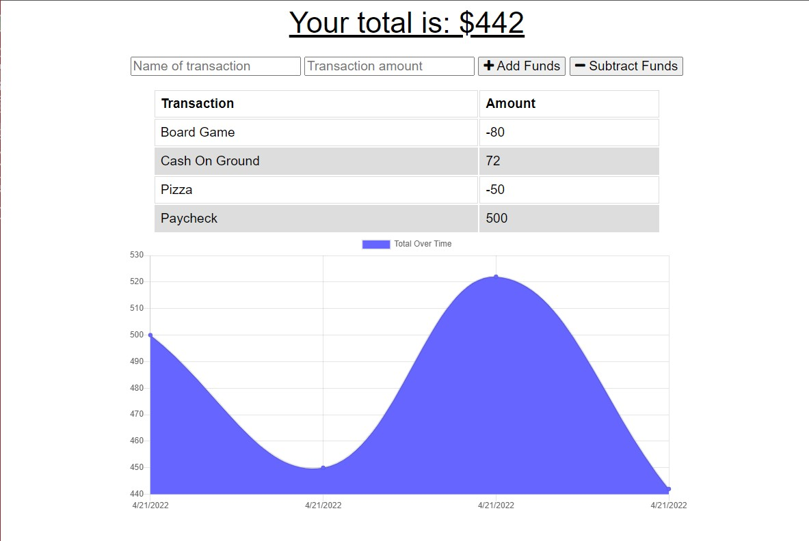

# Track My Budget

## Table of Contents

- [Usage](#usage)
- [Questions](#questions)

## Description

This is a little budget tracker app that is my week 19 challenge for the UofU coding bootcamp. In this app you can name a transaction, assign a value to that transaction and finally select whether that value gets added or subtracted from your total cash. This week we also learned about offline functionality and as such, you can still add things to the list even while you are in offline mode.

## Usage

To use this program simply click on the <a href="https://stark-badlands-41125.herokuapp.com/">Heroku Link here</a>.

## Questions

<a href="https://github.com/JohnKnee3">JohnKnee3's GitHub</a>

If you want to contact me please send me an email at john.a.clark3@yahoo.com and I will get back to you as soon as possible.
